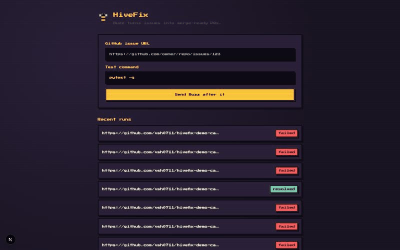

# HiveFix

Autonomous bug-resolution agent: takes a GitHub issue from triage to a merge-ready pull request, with no human edits in the loop. Built on LangGraph, with every patch gated behind a Docker-sandboxed regression run before a PR is opened.

**Live:** [hivefix-orchestrator.onrender.com](https://hivefix-orchestrator.onrender.com) · **Results:** [docs/technical_findings.md](docs/technical_findings.md) · [docs/eval_results.md](docs/eval_results.md)



Persona: **Buzz** — the HiveFix bee. The dashboard visualizes each run as Buzz flying between stages (scout → trail → pollinate → hive-check → honey delivered). PRs and commit messages themselves stay plain/professional; the persona lives only in the dashboard UI.

## Results

10/10 real, distinct bugs across 6 categories resolved end-to-end against a live demo
repo, each a minimal correct diff, **0% false-approval rate held across every
attempt** — the sandboxed test gate rejected every incorrect patch before a PR could
open, including two rejected attempts on the one issue that needed a prompt fix (a
real model reasoning gap, caught and fixed, re-validated against the exact case that
failed before). Full breakdown, real bugs found while building this, and the
deliberate tradeoffs behind the design: **[docs/technical_findings.md](docs/technical_findings.md)**.

## Scope (v1)

- Target repos: **Python** only (retrieval/AST call-graph tooling is Python-specific for v1)
- One issue → one run → one PR attempt loop, with a bounded retry count on sandbox failure

## Architecture

```mermaid
flowchart LR
    issue([GitHub issue URL]) --> triage

    subgraph graph["LangGraph orchestrator"]
        triage["Triage\nhivefix-triage\n(LLM)"]
        retrieve["Retrieve\nhivefix-retriever\nBM25 + AST call-graph\n(MCP) + Qdrant"]
        patch["Patch\nhivefix-patcher\n(LLM + diff repair)"]
        sandbox["Sandbox\nhivefix-verifier\ndispatch + poll"]
        gate{"Gate\nhivefix-gate"}
        publish["Open PR\nhivefix-publisher"]
        fail(["Abort\n(retries exhausted)"])

        triage --> retrieve --> patch --> sandbox --> gate
        gate -- "fail, retries left" --> patch
        gate -- "pass" --> publish
        gate -- "fail, exhausted" --> fail
    end

    sandbox -. dispatch .-> actions["GitHub Actions\nsandbox-test.yml\n(Docker)"]
    actions -. poll result .-> sandbox
    publish --> pr([Pull request])

    graph -.->|audit_log + state| redis[(Redis)]
    retrieve -.-> qdrant[(Qdrant)]
    graph -.->|trace per node identity| langsmith[[LangSmith]]
    redis -.->|live run state| dashboard["Dashboard\n(Next.js)"]
```

- **LangGraph** orchestrates the state machine above (`orchestrator/app/graph`).
- **LangChain** drives triage, retrieval tool-calling, and patch drafting.
- **MCP tools** (`orchestrator/app/mcp_tools`) expose BM25 code search and AST call-graph traversal to the agent for fault localization, called by the agent as real MCP tool-calling (not a direct function call).
- **Qdrant** holds embedded code chunks as a semantic-search fallback alongside BM25.
- **Redis** stores run state/events for the dashboard and acts as the run queue.
- **LangSmith** traces every graph run end-to-end, tagged per node identity.
- **RAGAS** (`orchestrator/app/eval`) scores patch groundedness against retrieved context offline, over a sampled issue set — see [docs/eval_results.md](docs/eval_results.md).
- **Docker** sandboxed regression runs happen via a GitHub Actions workflow (`.github/workflows/sandbox-test.yml`) dispatched by the orchestrator against the target repo — GitHub-hosted runners have Docker natively and are free for public repos.
- **Frontend** (`frontend/`) is a live dashboard showing Buzz move through the stages of a run, with diff and sandbox log viewers.

## Tech stack

| Layer | Tech |
|---|---|
| Agent orchestration | LangGraph (state machine), LangChain (LLM calls, tool binding) |
| LLM provider | Groq (OpenAI-compatible API via `langchain-groq`) |
| Tool-calling | MCP (`mcp` Python SDK) — BM25 + AST call-graph server, called over stdio |
| Retrieval | `rank-bm25`, Python `ast` module, Qdrant (vector store) |
| State / queue | Redis (run state, pub/sub for live dashboard updates) |
| Observability | LangSmith (per-node-identity tracing), structured audit trail in run state |
| Evaluation | RAGAS (faithfulness, context precision/recall) |
| Sandboxed verification | GitHub Actions + Docker (`python:3.11-slim`) |
| Backend API | FastAPI + Uvicorn |
| Frontend | Next.js (App Router) + Tailwind, SSE for live run streaming |
| Deployment | Docker (`docker-compose` locally), Render (orchestrator), Redis Cloud, Qdrant Cloud |
| Source control integration | GitHub REST API via PyGithub + GitPython |

## Agent identity, access & traceability

HiveFix is deliberately **one agent, one LangGraph process, one set of credentials** —
not a multi-agent swarm — but every node still acts under its own scoped identity
(`orchestrator/app/identity.py`), enforced rather than documentation-only:

| Node | Identity | Can do | Cannot do |
|---|---|---|---|
| triage | `hivefix-triage` | Read issue text, call the LLM | Nothing else |
| retrieve | `hivefix-retriever` | `bm25_search`, `callgraph_lookup`, `qdrant_search` (all read-only) | No repo writes, no sandbox dispatch |
| patch | `hivefix-patcher` | Draft a diff from context | No execution, no repo access |
| sandbox | `hivefix-verifier` | Dispatch + poll the sandbox-test workflow | No target-repo write access |
| gate | `hivefix-gate` | Decide retry / publish / abort | No external access |
| open_pr | `hivefix-publisher` | **The only identity that can branch/push/open a PR** | Nothing upstream of a passing sandbox run |

`ScopedGitHubClient` (`orchestrator/app/github/scoped_client.py`) enforces this: each
node constructs a client bound to its own `NodeIdentity`, and a call outside that
identity's `allowed_github_actions` raises `ScopedPermissionError` rather than
silently succeeding. `GITHUB_TOKEN` itself should be a fine-grained PAT scoped only to
HiveFix's own repo (for Actions dispatch) and the target repos it's permitted to open
PRs against — the code-level scoping is defense in depth, not a substitute for that.

**Approval model:** fully autonomous, matching the original goal of issue-to-PR with
no human edits in the loop. The human checkpoint is the PR review itself, not a gate
inside the agent. Safety instead comes from: a bounded retry count
(`MAX_PATCH_ATTEMPTS`), every patch being gated behind a real sandboxed test run
before a PR can be opened at all, and the publisher identity having no path to a PR
except through a passing `sandbox` result.

**Traceability:** every node appends a structured entry — identity, action, status,
detail — to `RunState["audit_log"]`, which is persisted and streamed to the dashboard
like the rest of the run state (`GET /runs/{run_id}` returns it; no separate store).
Every LLM call also carries the node's identity as a LangSmith tag/run-name, so the
audit log (what happened) and the LangSmith trace (why — full prompts/completions)
cross-reference by identity + run_id.

## How to run

```bash
git clone https://github.com/vsh0711/HiveFix.git && cd HiveFix
cp .env.example .env   # fill in GROQ_API_KEY, GITHUB_TOKEN, HIVEFIX_REPO, etc.
docker compose up --build
```

- Dashboard: http://localhost:3000
- Orchestrator API: http://localhost:8000
- Qdrant: http://localhost:6333 · Redis: localhost:6379

Trigger a run either from the dashboard form, or directly:

```bash
curl -X POST http://localhost:8000/runs \
  -H "Content-Type: application/json" \
  -d '{"issue_url": "https://github.com/<owner>/<repo>/issues/<n>", "test_command": "pytest -q"}'
```

Poll `GET /runs/{run_id}` (or watch the dashboard) for live status; a resolved run's
`pr_url` field has the opened pull request.

## Deployment

- Orchestrator API + Redis + Qdrant: free tiers (Render + Redis Cloud + Qdrant Cloud) — see [docs/deployment.md](docs/deployment.md).
- Sandboxed test execution: dispatched as a `workflow_dispatch` run on **this** repo's Actions (`.github/workflows/sandbox-test.yml`), which clones the target repo, applies the candidate patch, and runs its test suite inside Docker. The orchestrator polls the run via the GitHub API rather than relying on a callback.
